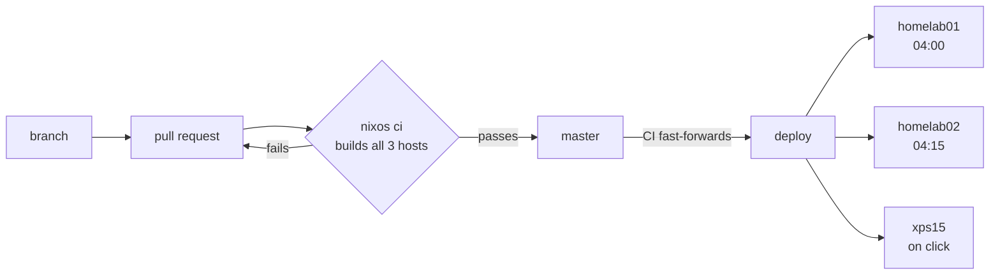

# Cory's NixOS Configuration

A three-machine NixOS fleet — two homelab servers and a laptop — deployed from this repository through a gated GitOps pipeline.

Every machine runs a configuration built and proven by CI before it was allowed to reach them. Nothing is applied by hand, nothing is deployed from a developer's laptop, and a host that quietly stops updating raises an alert rather than drifting unnoticed.

## How a change reaches a machine



`master` is the integration branch and may be red. **`deploy` is the fleet's contract** — CI fast-forwards it only after every host configuration builds, so a host can never fetch a revision that fails to build for it. Every host follows it, and both servers take a promoted revision the same night; each defends itself at activation rather than relying on the other to have soaked it first ([ADR 0002](docs/adr/0002-protect-at-activation-not-in-the-rollout.md)).

## Documentation

| Document                                                           | Covers                                                                     |
| ------------------------------------------------------------------ | -------------------------------------------------------------------------- |
| [The deployment pipeline](.github/workflows/README.md)             | how the refs and workflows behave, the invariants, and recovery procedures |
| [ADR 0001](docs/adr/0001-gitops-deployment-with-a-promoted-ref.md) | why the pipeline is designed this way, and what was rejected               |
| [ADR 0002](docs/adr/0002-protect-at-activation-not-in-the-rollout.md) | why the staged rollout was retired, and what replaces it                |
| [Deployment hardening plan](docs/plans/deployment-hardening.md)    | the gaps that remain and how they are meant to close                       |

## Working on it

```bash
# Iterate on a server without a commit, a push, or a CI round-trip
nixos-rebuild switch --flake .#homelab01 \
  --target-host root@homelab01 --build-host root@homelab01

# Pull the promoted revision now rather than waiting for 04:00
ssh homelab01 sudo systemctl start nixos-upgrade.service

# Local machine, from the working tree
sudo nixos-rebuild switch --flake .#xps15
```

`flake.lock` is CI's to move — running `nix flake update` by hand only creates a conflict with the nightly PR.

Direct pushes to `master` are rejected; changes go through a pull request. Adding a host means adding it to the `build` matrix in `.github/workflows/ci.yml`, and adding an auto-updating package means editing the package rather than the workflow — both are covered in [the pipeline docs](.github/workflows/README.md).

## Repository layout

```
dotfiles/
├── flake.nix              # Entry point: hosts, packages, checks, overlays
├── hosts/                 # Per-machine configuration
│   ├── homelab01/         # Compute + streaming
│   ├── homelab02/         # Storage + download (ZFS, NFS export)
│   └── xps15/             # Laptop
├── modules/
│   ├── nixos/             # System-level modules
│   ├── services/          # Homelab service modules (auto-imported)
│   └── home/              # Home-manager modules
├── configs/               # Portable dotfiles, symlinked by home-manager
├── overlays/              # Package overlays
├── packages/              # Custom package definitions
├── secrets/               # SOPS-encrypted secrets
└── docs/adr/              # Architecture decision records
```

Modules follow a consistent shape and are toggled per host:

```nix
# hosts/<host>/default.nix
cg = {
  hyprland.enable = true;
  nvidia.enable = true;
};

cg.service = {
  monitoring.enable = true;
};
```

```nix
{ config, lib, pkgs, ... }:
let
  cfg = config.cg.<name>;
in
{
  options.cg.<name>.enable = lib.mkEnableOption "description";

  config = lib.mkIf cfg.enable {
    # ...
  };
}
```

Everything under `modules/services/` is imported automatically, so a new service module only needs the file.

## Secrets

[sops-nix](https://github.com/Mic92/sops-nix) with age keys derived from each host's SSH host key, so a host can decrypt only what it is granted.

```bash
age-keygen -o ~/.config/sops/age/keys.txt   # generate a key
ssh-to-age < /etc/ssh/ssh_host_ed25519_key.pub   # derive a host's key
sops secrets/homelab.yaml                   # edit
```

## Homelab infrastructure

```
┌─────────────────────────────────────────────────────────────────┐
│                        homelab02 (NAS)                          │
│  HP Elitedesk 800 G6 • i7 10th Gen • 2×4TB HDDs                 │
├─────────────────────────────────────────────────────────────────┤
│  Primary Role: Storage + Download                               │
│                                                                 │
│  ┌─────────────┐  ┌─────────────┐  ┌─────────────┐              │
│  │ qBittorrent │  │ cross-seed  │  │  unpackerr  │              │
│  │  + gluetun  │  │             │  │             │              │
│  └─────────────┘  └─────────────┘  └─────────────┘              │
│                                                                 │
│  Storage: /srv/media (primary) ──── NFS export ────────────▶    │
│           - downloads/                                          │
│           - movies/                                             │
│           - tv/                                                 │
└─────────────────────────────────────────────────────────────────┘
                              │
                         NFS mount
                              │
                              ▼
┌─────────────────────────────────────────────────────────────────┐
│                       homelab01 (Compute)                       │
│  Dell Optiplex 5080 • i5 • Quick Sync                           │
├─────────────────────────────────────────────────────────────────┤
│  Primary Role: Media Management + Streaming                     │
│                                                                 │
│  ┌──────────┐ ┌──────────┐ ┌──────────┐ ┌──────────┐            │
│  │ Jellyfin │ │  Sonarr  │ │  Radarr  │ │ Prowlarr │            │
│  │(transcode│ │          │ │          │ │          │            │
│  └──────────┘ └──────────┘ └──────────┘ └──────────┘            │
│  ┌──────────┐ ┌──────────┐ ┌──────────┐ ┌──────────┐            │
│  │  Bazarr  │ │Jellyseerr│ │ Recyclarr│ │  Wizarr  │            │
│  └──────────┘ └──────────┘ └──────────┘ └──────────┘            │
│                                                                 │
│  Storage: /srv/media (NFS mount from homelab02)                 │
└─────────────────────────────────────────────────────────────────┘
```

## Known gaps

Stated plainly, because a pipeline whose limits are undocumented invites more trust than it has earned:

- **Building is the only pre-deploy gate, and building is not working.** A package that compiles and then fails at runtime will auto-merge and deploy. The alert rules catch it afterwards. NixOS VM tests are the intended fix.
- **Automated rollback covers only a generation that will not boot, and only on homelab01 so far.** systemd's boot assessment gives a new generation three attempts to reach `boot-complete.target`; one that never does is skipped in favour of an older entry, without anyone standing in front of the machine. A generation that boots and then fails to bring its services up is still recovered by fixing forward.
- **Nothing soaks a revision before it reaches the storage node.** Both servers take a promoted revision the same night. This is a deliberate bet, argued in [ADR 0002](docs/adr/0002-protect-at-activation-not-in-the-rollout.md): the staged rollout it replaces measured elapsed time rather than health, and the failure history here is service configuration rather than base-system regression. If a kernel bump ever takes both servers out on the same night, that bet was wrong.

Each of these is expanded, with the intended fix, in [the hardening plan](docs/plans/deployment-hardening.md).
