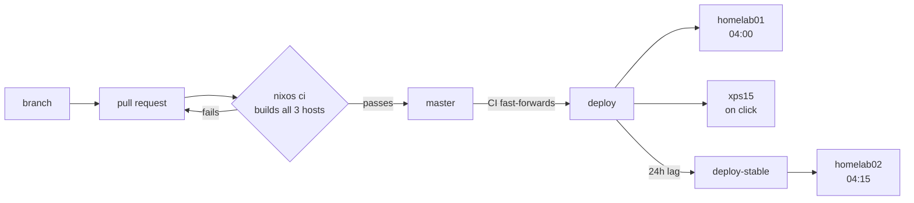

# Cory's NixOS Configuration

A three-machine NixOS fleet — two homelab servers and a laptop — deployed from this
repository through a gated GitOps pipeline.

Every machine runs a configuration built and proven by CI before it was allowed to reach
them. Nothing is applied by hand, nothing is deployed from a developer's laptop, and a
host that quietly stops updating raises an alert rather than drifting unnoticed.

The reasoning behind the design, including the alternatives that were rejected and why,
is in [ADR 0001](docs/adr/0001-gitops-deployment-with-a-promoted-ref.md).

## How a change reaches a machine



`master` is the integration branch and may be red. **`deploy` is the fleet's contract** —
CI fast-forwards it only after every host configuration builds, so a host can never fetch
a revision that fails to build for it.

| Ref | Followed by | Takes a revision |
| --- | --- | --- |
| `deploy` | homelab01, xps15 | the night it is promoted |
| `deploy-stable` | homelab02 | 24 hours later |

The servers are not interchangeable. homelab02 holds the ZFS pool and exports the NFS
storage homelab01 mounts, so it is the host whose failure cascades — it therefore takes
each revision a day after homelab01 has been running it. A kernel that fails to boot takes
out the compute node while the data node keeps serving.

The laptop follows `deploy` too, but never switches on its own: it builds in the
background and waits to be told, via a waybar indicator.

## What runs on its own

| Workflow | When | Does |
| --- | --- | --- |
| `ci.yml` | every PR and push to master | builds all three hosts, `nix flake check`, promotes `deploy` |
| `flake-update.yml` | daily, 15:00 UTC | `nix flake update`, per-host closure diff, PR, auto-merge on green |
| `promote-stable.yml` | daily, 19:30 UTC | fast-forwards `deploy-stable` to what `deploy` held 24h ago |
| `package-update.yml` | Mondays, 03:00 UTC | runs each package's own updater, one PR per package |

CI builds are pushed to a [Cachix](https://cachix.org) cache that the hosts substitute
from, so a closure is built once rather than once per machine.

Lock updates auto-merge when green. Package updates do not — they cross an upstream
release boundary, where "it built" is the weakest form of evidence.

## What happens when something breaks

Deployment state is exported as node_exporter textfile metrics and alerted on through the
existing Prometheus and Alertmanager stack:

| Alert | Catches |
| --- | --- |
| `NixosDeployFailed` | the upgrade ran and failed |
| `NixosDeployStale` | **no upgrade has run in 48 hours** |
| `NixosRebootPending` | a generation is staged but never activated |

The middle one is the point of the exercise. A host that stops upgrading raises nothing
else — no unit fails, no probe drops, it simply falls behind in silence.

The last one exists because `nixos-upgrade` runs `nixos-rebuild boot` and then reboots
*only* if the kernel changed and the clock is still inside the reboot window. A build that
runs long pushes it past that window, and the unit reports success while the new kernel
never activates.

Existing rules already cover services that fail to come back (`node_systemd_unit_state`)
and endpoints that stop responding (`probe_success` via blackbox).

## Working on it

```bash
# Iterate on a server without a commit, a push, or a CI round-trip
nixos-rebuild switch --flake .#homelab01 \
  --target-host root@homelab01 --build-host root@homelab01

# Pull the promoted revision now rather than waiting for 04:00
ssh homelab01 sudo systemctl start nixos-upgrade.service

# Local machine, from the working tree
sudo nixos-rebuild switch --flake .#xps15
```

`flake.lock` is CI's to move — running `nix flake update` by hand only creates a conflict
with the nightly PR.

Direct pushes to `master` are rejected; changes go through a pull request. Never create a
branch under `deploy/` or `deploy-stable/` — git stores refs as paths, so it would turn
those refs into directories and break promotion. A ruleset blocks this.

### Adding a host

1. Create `hosts/<hostname>/` with `default.nix`, `hardware.nix` and `home.nix`
2. Register it in `flake.nix` under `nixosConfigurations`
3. Add it to the `build` matrix in `.github/workflows/ci.yml` — a host that CI does not
   build is a host the gate does not protect

### Adding an auto-updating package

Packages pinned to an upstream tag or an npm version do not move when the lock does.
Declare an updater on the package itself:

```nix
passthru = {
  autoUpdate = true;
  updateScript = [ "packages/<name>/update.sh" ];
};
```

`updateScript` is an argv list run from the repository root. It mutates the working tree,
prints **nothing** when already current, and on a change prints a one-line summary first.
`package-update.yml` discovers anything with `autoUpdate` set, so adding a package means
editing the package, not the workflow.

Participation is an explicit flag rather than the presence of `updateScript` because
nixpkgs' `buildPythonApplication` sets a default one of its own.

## Repository layout

```
dotfiles/
├── flake.nix              # Entry point: hosts, packages, checks, overlays
├── hosts/                 # Per-machine configuration
│   ├── homelab01/         # Compute + streaming
│   ├── homelab02/         # Storage + download (ZFS, NFS export)
│   └── xps15/             # Laptop
├── modules/
│   ├── nixos/             # System-level modules
│   ├── services/          # Homelab service modules (auto-imported)
│   └── home/              # Home-manager modules
├── configs/               # Portable dotfiles, symlinked by home-manager
├── overlays/              # Package overlays
├── packages/              # Custom package definitions
├── secrets/               # SOPS-encrypted secrets
└── docs/adr/              # Architecture decision records
```

Modules follow a consistent shape and are toggled per host:

```nix
# hosts/<host>/default.nix
cg = {
  hyprland.enable = true;
  nvidia.enable = true;
};

cg.service = {
  monitoring.enable = true;
};
```

```nix
{ config, lib, pkgs, ... }:
let
  cfg = config.cg.<name>;
in
{
  options.cg.<name>.enable = lib.mkEnableOption "description";

  config = lib.mkIf cfg.enable {
    # ...
  };
}
```

Everything under `modules/services/` is imported automatically, so a new service module
only needs the file.

## Secrets

[sops-nix](https://github.com/Mic92/sops-nix) with age keys derived from each host's SSH
host key, so a host can decrypt only what it is granted.

```bash
age-keygen -o ~/.config/sops/age/keys.txt   # generate a key
ssh-to-age < /etc/ssh/ssh_host_ed25519_key.pub   # derive a host's key
sops secrets/homelab.yaml                   # edit
```

## Homelab infrastructure

```
┌─────────────────────────────────────────────────────────────────┐
│                        homelab02 (NAS)                          │
│  HP Elitedesk 800 G6 • i7 10th Gen • 2×4TB HDDs                 │
├─────────────────────────────────────────────────────────────────┤
│  Primary Role: Storage + Download                               │
│                                                                 │
│  ┌─────────────┐  ┌─────────────┐  ┌─────────────┐              │
│  │ qBittorrent │  │ cross-seed  │  │  unpackerr  │              │
│  │  + gluetun  │  │             │  │             │              │
│  └─────────────┘  └─────────────┘  └─────────────┘              │
│                                                                 │
│  Storage: /srv/media (primary) ──── NFS export ────────────▶    │
│           - downloads/                                          │
│           - movies/                                             │
│           - tv/                                                 │
└─────────────────────────────────────────────────────────────────┘
                              │
                         NFS mount
                              │
                              ▼
┌─────────────────────────────────────────────────────────────────┐
│                       homelab01 (Compute)                       │
│  Dell Optiplex 5080 • i5 • Quick Sync                           │
├─────────────────────────────────────────────────────────────────┤
│  Primary Role: Media Management + Streaming                     │
│                                                                 │
│  ┌──────────┐ ┌──────────┐ ┌──────────┐ ┌──────────┐            │
│  │ Jellyfin │ │  Sonarr  │ │  Radarr  │ │ Prowlarr │            │
│  │(transcode│ │          │ │          │ │          │            │
│  └──────────┘ └──────────┘ └──────────┘ └──────────┘            │
│  ┌──────────┐ ┌──────────┐ ┌──────────┐ ┌──────────┐            │
│  │  Bazarr  │ │Jellyseerr│ │ Recyclarr│ │  Wizarr  │            │
│  └──────────┘ └──────────┘ └──────────┘ └──────────┘            │
│                                                                 │
│  Storage: /srv/media (NFS mount from homelab02)                 │
└─────────────────────────────────────────────────────────────────┘
```

## Known gaps

Stated plainly, because a pipeline whose limits are undocumented invites more trust than
it has earned:

- **Building is the only pre-deploy gate, and building is not working.** A package that
  compiles and then fails at runtime will auto-merge and deploy. The alert rules catch it
  afterwards. NixOS VM tests are the intended fix — see
  [the hardening plan](docs/plans/deployment-hardening.md).
- **There is no automated rollback.** A bad deploy is recovered by fixing forward, or by
  selecting an older generation at the boot menu. Options are sketched in the same plan.
- **The `deploy-stable` lag is time-based, not health-based.** It establishes that
  homelab01 has *had* a revision for 24 hours, not that homelab01 is well.
- **The canary soak is weaker for host-specific packages.** A ZFS or qBittorrent
  regression will not surface on homelab01, which runs neither. What it does exercise is
  the shared base — kernel, systemd, nix, glibc — which is where an unattended update does
  catastrophic rather than annoying damage.
