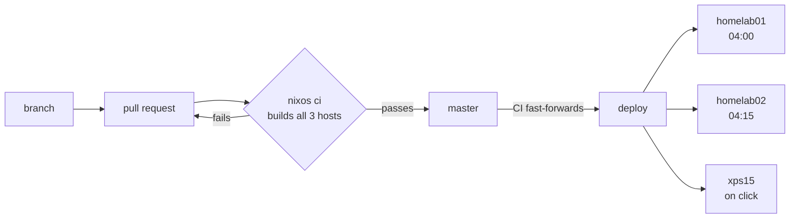

# Cory's NixOS Configuration

A three-machine NixOS fleet — two homelab servers and a laptop — deployed from this repository through a gated GitOps pipeline.

Every machine runs a configuration built and proven by CI before it was allowed to reach them. Nothing is applied by hand, nothing is deployed from a developer's laptop, and a host that quietly stops updating raises an alert rather than drifting unnoticed.

## How a change reaches a machine



`master` is the integration branch and may be red. **`deploy` is the fleet's contract** — CI fast-forwards it only after every host configuration builds, so a host can never fetch a revision that fails to build for it. Every host follows it, and both servers take a promoted revision the same night; each defends itself at activation rather than relying on the other to have soaked it first ([ADR 0002](docs/adr/0002-protect-at-activation-not-in-the-rollout.md)).

## Documentation

| Document                                                           | Covers                                                                     |
| ------------------------------------------------------------------ | -------------------------------------------------------------------------- |
| [The deployment pipeline](.github/workflows/README.md)             | how the refs and workflows behave, the invariants, and recovery procedures |
| [ADR 0001](docs/adr/0001-gitops-deployment-with-a-promoted-ref.md) | why the pipeline is designed this way, and what was rejected               |
| [ADR 0002](docs/adr/0002-protect-at-activation-not-in-the-rollout.md) | why the staged rollout was retired, and what replaces it                |
| [ADR 0003](docs/adr/0003-service-confinement-is-bounded-by-hardlinking.md) | _proposed_ - why confining services to their own data is mostly not available |
| [Deployment hardening plan](docs/plans/deployment-hardening.md)    | the gaps that remain and how they are meant to close                       |

## Working on it

```bash
# Iterate on a server without a commit, a push, or a CI round-trip
nixos-rebuild switch --flake .#homelab01 \
  --target-host coryg@homelab01 --elevate=sudo --ask-elevate-password

# Pull the promoted revision now rather than waiting for 04:00
ssh homelab01 sudo systemctl start nixos-upgrade.service

# Local machine, from the working tree
sudo nixos-rebuild switch --flake .#xps15

# See the digital garden as it will be published, without publishing it
nix run .#garden-preview
```

`garden-preview` renders the published subset of the local Obsidian vault with the
same renderer and serves it with the same Caddy config the server uses, then
re-renders whenever a note or the site's stylesheet
(`modules/services/digital-garden/lib/hugo/assets/main.css`) changes. Before it
existed, seeing a CSS change meant a full PR -> gate -> merge -> promote ->
upgrade round trip, which is minutes; the render itself is under a second.

`coryg@`, not `root@` — `cg.ssh-hardening` sets `PermitRootLogin = "no"` and `AllowUsers = [ "coryg" ]`, so root SSH is refused on both servers. `--elevate=sudo` is what then runs the activation as root, and `--ask-elevate-password` is needed because `wheelNeedsPassword` is on. That command is long enough to discourage the iteration it exists for, which is [item 6](docs/plans/deployment-hardening.md) of the hardening plan.

`flake.lock` is CI's to move — running `nix flake update` by hand only creates a conflict with the nightly PR.

Direct pushes to `master` are rejected; changes go through a pull request. Adding a host means adding it to the `build` matrix in `.github/workflows/ci.yml`, and adding an auto-updating package means editing the package rather than the workflow — both are covered in [the pipeline docs](.github/workflows/README.md).

## Repository layout

```
dotfiles/
├── flake.nix              # Entry point: hosts, packages, checks, overlays
├── hosts/                 # Per-machine configuration
│   ├── homelab01/         # Compute + streaming
│   ├── homelab02/         # Storage + download (ZFS, NFS export)
│   └── xps15/             # Laptop
├── profiles/              # Composed opinions: what a machine costs to be
├── modules/
│   ├── nixos/             # System-level modules
│   ├── services/          # Homelab service modules (auto-imported)
│   └── home/              # Home-manager modules
├── checks/                # Behaviour tests: NixOS VMs booted by `nix flake check`
├── configs/               # Portable dotfiles, symlinked by home-manager
├── overlays/              # Package overlays
├── packages/              # Custom package definitions
├── secrets/               # SOPS-encrypted secrets
└── docs/adr/              # Architecture decision records
```

`profiles/` sits between the two: a module offers an option and does nothing until a host enables it, while a profile makes a decision and offers nothing. `cg.boot-counting` is a module; "servers in this fleet do not suspend" is a profile. A host imports `profiles/common.nix` plus the one for what kind of machine it is, and what is left in the host file is the auto-upgrade block, the toggles, and the hardware. The rule that keeps `profiles/` from becoming a second module system: **a profile has no options** — anything that has to differ per host is a module.

Modules follow a consistent shape and are toggled per host:

```nix
# hosts/<host>/default.nix
cg = {
  hyprland.enable = true;
  nvidia.enable = true;
};

cg.service = {
  monitoring.enable = true;
};
```

```nix
{ config, lib, pkgs, ... }:
let
  cfg = config.cg.<name>;
in
{
  options.cg.<name>.enable = lib.mkEnableOption "description";

  config = lib.mkIf cfg.enable {
    # ...
  };
}
```

Everything under `modules/services/` is imported automatically, so a new service module only needs the file.

## Secrets

[sops-nix](https://github.com/Mic92/sops-nix) with age keys derived from each host's SSH host key, so a host can decrypt only what it is granted.

```bash
age-keygen -o ~/.config/sops/age/keys.txt   # generate a key
ssh-to-age < /etc/ssh/ssh_host_ed25519_key.pub   # derive a host's key
sops secrets/homelab.yaml                   # edit
```

## Homelab infrastructure

```
┌─────────────────────────────────────────────────────────────────┐
│                        homelab02 (NAS)                          │
│  HP Elitedesk 800 G6 • i7 10th Gen • 2×4TB HDDs                 │
├─────────────────────────────────────────────────────────────────┤
│  Primary Role: Storage + Download                               │
│                                                                 │
│  ┌─────────────┐  ┌─────────────┐  ┌─────────────┐              │
│  │ qBittorrent │  │ cross-seed  │  │  unpackerr  │              │
│  │  + gluetun  │  │             │  │             │              │
│  └─────────────┘  └─────────────┘  └─────────────┘              │
│                                                                 │
│  Storage: /srv/media (primary) ──── NFS export ────────────▶    │
│           - downloads/                                          │
│           - movies/                                             │
│           - tv/                                                 │
└─────────────────────────────────────────────────────────────────┘
                              │
                         NFS mount
                              │
                              ▼
┌─────────────────────────────────────────────────────────────────┐
│                       homelab01 (Compute)                       │
│  Dell Optiplex 5080 • i5 • Quick Sync                           │
├─────────────────────────────────────────────────────────────────┤
│  Primary Role: Media Management + Streaming                     │
│                                                                 │
│  ┌──────────┐ ┌──────────┐ ┌──────────┐ ┌──────────┐            │
│  │ Jellyfin │ │  Sonarr  │ │  Radarr  │ │ Prowlarr │            │
│  │(transcode│ │          │ │          │ │          │            │
│  └──────────┘ └──────────┘ └──────────┘ └──────────┘            │
│  ┌──────────┐ ┌──────────┐ ┌──────────┐ ┌──────────┐            │
│  │  Bazarr  │ │Jellyseerr│ │ Recyclarr│ │  Wizarr  │            │
│  └──────────┘ └──────────┘ └──────────┘ └──────────┘            │
│                                                                 │
│  Storage: /srv/media (NFS mount from homelab02)                 │
└─────────────────────────────────────────────────────────────────┘
```

## Alerting

Prometheus evaluates the rules in `modules/services/monitoring/alert-rules.yml` on both servers; a two-node Alertmanager cluster deduplicates them. Notifications leave through two deliberately unequal lanes:

- **Push (ntfy, self-hosted on homelab01).** Critical alerts arrive with urgent priority and buzz. Warnings arrive silently, repeat no more often than daily, and are muted between 22:00 and 07:00 (Australia/Perth) — read them at breakfast. Resolutions follow their alert's lane: a resolved critical lands as an ordinary-priority all-clear.
- **Email (the archive lane).** Everything reaches it regardless of severity, grouped by alert name so a fan-out of related alerts is one message.

Inhibition rules keep one root cause from fanning out into many notifications: an unreachable host suppresses every alert sourced from its exporters, a downed tunnel suppresses the probe failures it would otherwise cause, and a degraded ZFS pool supersedes the per-symptom alerts describing the same disks.

The answer to "is anything wrong right now" is the **Fleet Overview** Grafana dashboard (provisioned in code): firing alerts, unreachable targets, backup and upgrade verdicts, per-host vitals. The Prometheus and Alertmanager UIs are published LAN-only (`prometheus.gyarmathy.co`, `alertmanager.gyarmathy.co`) for silences and ad-hoc queries; remotely, ssh-tunnel as before.

First-deployment bootstrap for ntfy accounts and tokens is documented at the top of `modules/services/ntfy.nix`.

## Known gaps

Stated plainly, because a pipeline whose limits are undocumented invites more trust than it has earned:

- **Building is still most of the pre-deploy gate.** A package that compiles and then fails at runtime will auto-merge and deploy. NixOS VM tests in `checks/` now cover the monitoring stack, the reverse proxy and the digital garden — enough to catch a Prometheus config that will not load, a Caddyfile that will not parse, or a garden that builds successfully and serves an incomplete or leaking site — but the media stack is not covered, and that is where the failure history actually is. The alert rules still catch the rest afterwards.
- **Automated rollback covers only a generation that will not boot, and only on homelab01 so far.** systemd's boot assessment gives a new generation three attempts to reach `boot-complete.target`; one that never does is skipped in favour of an older entry, without anyone standing in front of the machine.
- **A generation that boots and then comes up broken is detected but not yet reverted.** Both servers verify what they activated and alert if units are failing that were not failing before, but the rollback that check is wired to is deliberately switched off until there is evidence about its false-positive rate. Until then this is a faster, better-aimed alert, not a recovery.
- **Nothing protects against a change that cuts the host off.** Verification runs on the host, so a machine that has lost its network still believes it is fine — and locally, it is. A bad firewall or sshd change still means a trip to the cupboard.
- **Nothing soaks a revision before it reaches the storage node.** Both servers take a promoted revision the same night. This is a deliberate bet, argued in [ADR 0002](docs/adr/0002-protect-at-activation-not-in-the-rollout.md): the staged rollout it replaces measured elapsed time rather than health, and the failure history here is service configuration rather than base-system regression. If a kernel bump ever takes both servers out on the same night, that bet was wrong.

Each of these is expanded, with the intended fix, in [the hardening plan](docs/plans/deployment-hardening.md).
